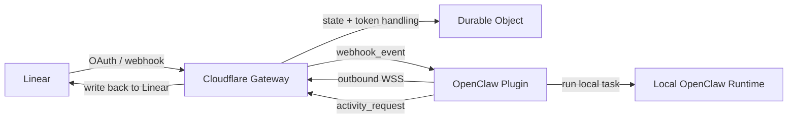
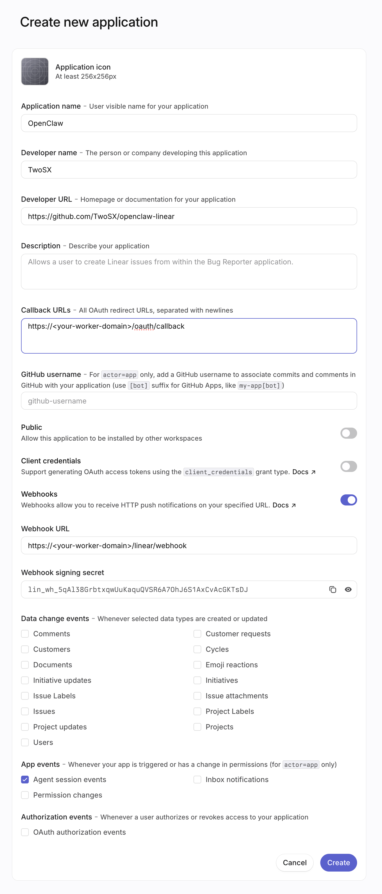
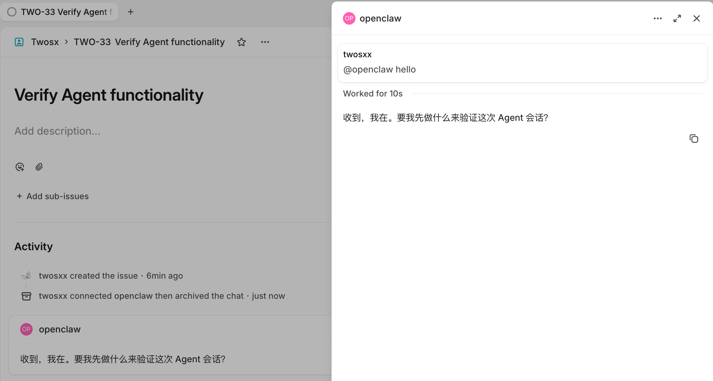

# OpenClaw Linear

[English](./README.md) | [简体中文](./README.zh-CN.md)

`OpenClaw Linear` lets you run a local OpenClaw agent from Linear without exposing your OpenClaw runtime to the public internet.

It works by placing a Cloudflare-hosted gateway between Linear and your local OpenClaw installation:

- Linear sends OAuth callbacks and `AgentSessionEvent` webhooks to the gateway
- the gateway keeps the active Linear installation and refreshes tokens
- a local OpenClaw plugin keeps one outbound WebSocket connection to the gateway
- the plugin runs local OpenClaw sessions and sends activity updates back to Linear

## What You Get

- Linear Agent Session webhook handling
- Local OpenClaw execution without inbound public access
- Linear activity updates for:
  - `thought`
  - `action`
  - `response`
  - `elicitation`
  - `error`
- OAuth handling and token refresh on Cloudflare
- A `/linear/mcp` route that proxies the official Linear MCP using the active installation token

## Integration Flow



## Step 1: Deploy the Gateway

Clone the repository:

```bash
git clone https://github.com/TwoSX/openclaw-linear.git
cd openclaw-linear
```

The gateway lives in:

- `/apps/gateway`

Deploy it with Wrangler:

```bash
pnpm install
pnpm --filter ./apps/gateway exec wrangler deploy
```

After deployment, note the public Worker URL, for example:

```text
https://your-worker.example.com
```

All later configuration will be based on this URL. If you attach a custom domain, update the following configuration accordingly.

## Step 2: Create a Linear Application

Create a new application in Linear.

Go to `Settings > API > OAuth Applications > Create New Application`.

Use these values:

- Callback URL:
  - `https://<your-worker-domain>/oauth/callback`
- Webhooks:
  - enabled
- Webhook URL:
  - `https://<your-worker-domain>/linear/webhook`
- App events:
  - enable `Agent session events`



After creation, Linear will give you:

- `Client ID`
- `Client Secret`
- `Webhook Secret`

## Step 3: Configure Gateway Secrets

Use the values from Step 2 together with your own `CLIENT_AUTH_TOKEN`:

```bash
pnpm --filter ./apps/gateway exec wrangler secret put LINEAR_CLIENT_ID
pnpm --filter ./apps/gateway exec wrangler secret put LINEAR_CLIENT_SECRET
pnpm --filter ./apps/gateway exec wrangler secret put LINEAR_WEBHOOK_SECRET
# run `openssl rand -hex 16` to generate a random CLIENT_AUTH_TOKEN
pnpm --filter ./apps/gateway exec wrangler secret put CLIENT_AUTH_TOKEN
```

## Step 4: Complete OAuth Authorization

Open:

```text
https://<your-worker-domain>/oauth/authorize
```

After authorization, the gateway will:

- store the active Linear installation
- refresh and persist the access token
- display the plugin install command (you need to install the plugin before proceeding if you haven't yet installed it)
- display a ready-to-copy `channels.linear` configuration snippet with `gatewayBaseUrl` and `clientAuthToken`
- start accepting `AgentSessionEvent` traffic from Linear

## Step 5: Install the OpenClaw Plugin

Install it from npm:

```bash
openclaw plugins install openclaw-channel-linear
openclaw gateway restart
```

## Step 6: Configure `channels.linear`

Use the values shown on the OAuth success page.

Minimal configuration:

```json
{
  "channels": {
    "linear": {
      "enabled": true,
      "gatewayBaseUrl": "https://<your-worker-domain>",
      "clientAuthToken": "CLIENT_AUTH_TOKEN",
      "healthMonitor": {
        "enabled": false
      }
    }
  }
}
```

Restart the gateway after updating the configuration:

```bash
openclaw gateway restart
```

Required fields:

- `gatewayBaseUrl`
- `clientAuthToken`

Optional fields:

- `promptContextTemplate`
- `debugTranscriptTrace`

Or configure it directly from the CLI:

```bash
openclaw config set channels.linear.enabled true --strict-json
openclaw config set channels.linear.gatewayBaseUrl '"https://<your-worker-domain>"' --strict-json
openclaw config set channels.linear.clientAuthToken '"<same-as-CLIENT_AUTH_TOKEN>"' --strict-json
openclaw config set channels.linear.healthMonitor.enabled false --strict-json
openclaw gateway restart
```

## Step 7: Verify the Integration

Create an issue in Linear and either assign it to the agent or mention the agent in the issue comments.

Expected behavior:

1. Linear sends an `AgentSessionEvent` to the gateway
2. the gateway forwards the event to the fixed Durable Object
3. the local OpenClaw plugin receives the event over WebSocket
4. OpenClaw runs locally
5. activity updates and the final response are written back to Linear



## `promptContextTemplate`

`promptContextTemplate` controls the context passed to OpenClaw when an `AgentSession` starts.

Supported variable:

- `$issueContext` - the raw `promptContext` from Linear, which can include issue description, comments, and other session context. See the [official promptContext field documentation](https://linear.app/developers/agent-interaction#collapsible-6a944bd6e1df) for details.

Example:

```json
{
  "channels": {
    "linear": {
      "enabled": true,
      "gatewayBaseUrl": "https://your-worker.example.com",
      "clientAuthToken": "<same-as-CLIENT_AUTH_TOKEN>",
      "promptContextTemplate": "You are handling a Linear agent session.\n\nBelow is the initial task context provided by Linear. Treat it as the primary context for this task.\nPrioritize actions based on the current issue context. If information is missing, ask concise questions first and do not invent facts.\n\n<linear_prompt_context>\n$issueContext\n</linear_prompt_context>",
      "healthMonitor": {
        "enabled": false
      }
    }
  }
}
```

If `$issueContext` is missing from the template, the original context is appended automatically.

## `linear/mcp`

The gateway exposes:

- `GET|POST|OPTIONS /linear/mcp`

It proxies the official Linear MCP endpoint:

- `https://mcp.linear.app/mcp`

Authentication:

- `Authorization: Bearer <CLIENT_AUTH_TOKEN>`

The gateway always uses the currently active installation token when proxying the request.

Benefits of this setup:

- reuse the active agent token for MCP access without extra token management
- let OpenClaw access Linear through a dedicated MCP-facing identity without additional paid seats

Example:

```bash
curl -i \
  -H 'Authorization: Bearer <same-as-CLIENT_AUTH_TOKEN>' \
  'https://<your-worker-domain>/linear/mcp'
```

### How to use MCP from OpenClaw

OpenClaw does not currently speak MCP directly, so use [mcporter](https://github.com/steipete/mcporter) as the bridge.

#### Install mcporter

```bash
npm install -g mcporter
```

#### Configure mcporter

```bash
# add the Linear MCP endpoint
mcporter config add linear https://<your-worker-domain>/linear/mcp \
  --header "Authorization=Bearer <CLIENT_AUTH_TOKEN>" \
  --scope home

# if this prints tool metadata, the MCP endpoint is ready
mcporter list linear
```

#### Configure OpenClaw

Use a skill so OpenClaw can call Linear through mcporter.

The Linear skill lives in `./skills/linear`. Copy it into your OpenClaw skills directory:

```bash
cp -r ./skills/linear ~/.openclaw/workspace/skills/linear
```

After that, using the `linear` skill in OpenClaw will route Linear API calls through mcporter and the MCP proxy.

You can also add a hint to `promptContextTemplate` so the agent knows when to use the skill. For example, append:

```text
You can use `linear` skill to call linear API. You can obtain more information by reading `<workspace>/skills/linear/SKILL.md`.
```

## Troubleshooting

### OpenClaw status

```bash
openclaw status --deep
openclaw plugins inspect linear
```

### Common checks

- Does `/oauth/authorize` redirect to Linear correctly?
- Does the WebSocket receive `control.connected` first?
- Is `Agent session events` enabled in Linear?
- Does `channels.linear.healthMonitor.enabled` remain `false`?
- Does `clientAuthToken` match `CLIENT_AUTH_TOKEN` exactly?
- Does the local OpenClaw log contain:
  - `[openclaw-linear] connected to gateway`

## Known Limitations

- single active Linear organization per deployment
- single active plugin client connection
- `stop` does not yet cancel a local task that is already running
- the current npm package name produces an accepted non-blocking warning on current OpenClaw releases

## Development

Development commands are intentionally kept at the end.

```bash
pnpm install
pnpm typecheck
pnpm test
pnpm build
pnpm --filter ./apps/gateway dev
pnpm --filter ./apps/gateway exec wrangler deploy --dry-run
```

Plugin-only validation:

```bash
pnpm --filter ./packages/plugin typecheck
pnpm --filter ./packages/plugin test
pnpm --filter ./packages/plugin build
cd packages/plugin && npm pack --dry-run
```

More Resources:

- [简体中文 README](./README.zh-CN.md)
- [Linear OAuth 2.0 Authentication](https://linear.app/developers/oauth-2-0-authentication)
- [Linear Agents](https://linear.app/developers/agents)
- [Linear Agent Interaction](https://linear.app/developers/agent-interaction)
- [Linear Agent Best Practices](https://linear.app/developers/agent-best-practices)
- [OpenClaw: Building Plugins](https://docs.openclaw.ai/plugins/building-plugins)
- [OpenClaw: SDK Channel Plugins](https://docs.openclaw.ai/plugins/sdk-channel-plugins)
- [OpenClaw: SDK Setup](https://docs.openclaw.ai/plugins/sdk-setup)
- [OpenClaw: SDK Testing](https://docs.openclaw.ai/plugins/sdk-testing)

## License

[MIT](./LICENSE)
