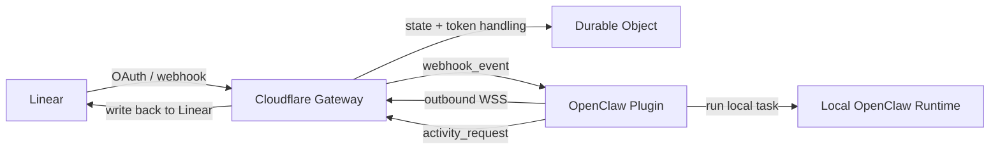

# OpenClaw Linear

[English](./README.md) | [简体中文](./README.zh-CN.md)

`OpenClaw Linear` 用来把 `Linear Agent Session` 接到本地 `OpenClaw`，同时避免把本地 OpenClaw 直接暴露到公网。

它的工作方式是：在 Linear 和本地 OpenClaw 之间放置一个部署在 Cloudflare 上的 gateway。

- Linear 把 OAuth 回调和 `AgentSessionEvent` webhook 发到 gateway
- gateway 保存当前激活的 Linear installation，并负责 token 刷新
- 本地 OpenClaw 插件保持一条到 gateway 的出站 WebSocket 连接
- 插件启动本地 OpenClaw run，并把 activity 更新回送给 Linear

## 能力概览

- 接收 Linear Agent Session webhook
- 在本地运行 OpenClaw，而不需要开放入站公网访问
- 把处理中状态和最终结果回写到 Linear
- 通过 `/linear/mcp` 代理官方 Linear MCP
- 在 Cloudflare 侧统一处理 OAuth、token 刷新和 Linear SDK 调用

## 集成流程



## 第一步：部署 Gateway

拉取仓库代码

```bash
git clone https://github.com/TwoSX/openclaw-linear.git
cd openclaw-linear
```

gateway 位于：

- `/apps/gateway`

使用 Wrangler 部署：

```bash
pnpm install
pnpm --filter ./apps/gateway exec wrangler deploy
```

部署成功后，记下 Worker 的公网地址，例如：

```text
https://your-worker.example.com
```

后续所有配置都会围绕这个地址展开。如果添加`自定义域`，后面的配置需要相应调整。

## 第二步：在 Linear 中创建 Application

在 Linear 设置中创建一个新的 application。

前往 `Settings > API > OAuth Applications > Create New Application`

推荐填写：

- Callback URL:
  - `https://<your-worker-domain>/oauth/callback`
- Webhooks:
  - 开启
- Webhook URL:
  - `https://<your-worker-domain>/linear/webhook`
- App events:
  - 勾选 `Agent session events`


创建完成后，你会拿到：

- `Client ID`
- `Client Secret`
- `Webhook Secret`


## 第三步：配置 Gateway Secrets

把第二步得到的值，以及你自己生成的一段 `CLIENT_AUTH_TOKEN`，写回 gateway 的 secrets：

```bash
pnpm --filter ./apps/gateway exec wrangler secret put LINEAR_CLIENT_ID
pnpm --filter ./apps/gateway exec wrangler secret put LINEAR_CLIENT_SECRET
pnpm --filter ./apps/gateway exec wrangler secret put LINEAR_WEBHOOK_SECRET
# 执行 `openssl rand -hex 16` 生成一个随机字符串，作为 CLIENT_AUTH_TOKEN
pnpm --filter ./apps/gateway exec wrangler secret put CLIENT_AUTH_TOKEN
```

## 第四步：完成 OAuth 授权

打开：

```text
https://<your-worker-domain>/oauth/authorize
```

授权成功后，gateway 会：

- 保存当前激活的 Linear organization
- 刷新并保存 access token
- 展示 OpenClaw 安装本插件的命令，如果还没安装插件，需要先安装插件才能继续
- 直接展示一段可复制的 `channels.linear` 配置，其中包含 `gatewayBaseUrl` 和 `clientAuthToken`
- 之后就能接收 Linear 发来的 AgentSessionEvent 了

## 第五步：安装 OpenClaw 插件

### 从 npm 安装

安装命令：

```bash
openclaw plugins install openclaw-channel-linear
openclaw gateway restart
```

## 第六步：配置 `channels.linear`

直接使用 OAuth 成功页里给出的配置值。

最小配置如下：

```json
{
  "channels": {
    "linear": {
      "enabled": true,
      "gatewayBaseUrl": "https://<your-worker-domain>",
      "clientAuthToken": "CLIENT_AUTH_TOKEN",
      "healthMonitor": {
        "enabled": false
      }
    }
  }
}
```

配置后重启 gateway：

```bash
openclaw gateway restart
```

必填项：

- `gatewayBaseUrl`
- `clientAuthToken`

可选项：

- `promptContextTemplate`
- `debugTranscriptTrace`

或者直接用命令行：

```bash
openclaw config set channels.linear.enabled true --strict-json
openclaw config set channels.linear.gatewayBaseUrl '"https://<your-worker-domain>"' --strict-json
openclaw config set channels.linear.clientAuthToken '"<same-as-CLIENT_AUTH_TOKEN>"' --strict-json
openclaw config set channels.linear.healthMonitor.enabled false --strict-json
openclaw gateway restart
```

## 第七步：验证集成结果

在 Linear 中创建 issue 并指派给 Agent 或者在 issue 评论区 @Agent 进行互动。

正常情况下，链路应为：

1. Linear 把 `AgentSessionEvent` 发送到 gateway
2. gateway 把事件投递到固定 Durable Object
3. 本地 OpenClaw 插件通过 WebSocket 收到事件
4. 插件启动本地 OpenClaw run
5. gateway 把中间状态和最终结果回写到 Linear


## `promptContextTemplate`

`promptContextTemplate` 作用于 AgentSession 开始时传递给 OpenClaw 的上下文。

支持的变量：

- `$issueContext` - 来自 Linear 的原始上下文 `promptContext`，包含 issue 描述、评论等信息，参考 [官方文档 - promptContext field](https://linear.app/developers/agent-interaction#collapsible-6a944bd6e1df) 了解详情。

默认值：

```plaintext
You are handling a Linear agent session.

Below is the initial task context provided by Linear. Treat it as the primary context for this task.
Prioritize actions based on the current issue context. If information is missing, ask concise questions first and do not invent facts.

<linear_prompt_context>
$issueContext
</linear_prompt_context>
```

示例：

```json
{
  "channels": {
    "linear": {
      "enabled": true,
      "gatewayBaseUrl": "https://<your-worker-domain>",
      "clientAuthToken": "<same-as-CLIENT_AUTH_TOKEN>",
      "promptContextTemplate": "You are handling a Linear agent session.\n\nBelow is the initial task context provided by Linear. Treat it as the primary context for this task.\nPrioritize actions based on the current issue context. If information is missing, ask concise questions first and do not invent facts.\n\n<linear_prompt_context>\n$issueContext\n</linear_prompt_context> \n\nYou can use linear skills to call linear API. You can obtain more information by reading `<workspace>/skills/linear/SKILL.md`.",
      "healthMonitor": {
        "enabled": false
      }
    }
  }
}
```

如果模板中没有 `$issueContext`，系统会自动把原始上下文拼接到末尾。

## MCP 配置

gateway 暴露：

- `GET|POST|OPTIONS /linear/mcp`

它会代理官方 Linear MCP：

- `https://mcp.linear.app/mcp`

认证方式：

- `Authorization: Bearer <CLIENT_AUTH_TOKEN>`

gateway 会始终使用当前激活 installation 的 token 转发请求。

这么做的好处是：

- 复用 Agent token 直接访问 MCP，无需额外配置
- 可以给 OpenClaw 使用，拥有独立的 linear 用户身份，不需要额外付费

### 如何在 OpenClaw 中使用 MCP

OpenClaw 本身不支持 MCP, 需要借助 [mcporter](https://github.com/steipete/mcporter) 工具。

#### 安装 mcporter：

```bash
npm install -g mcporter
```

#### 配置 mcporter：

```bash
# 添加线性 MCP 配置
mcporter config add linear https://<your-worker-domain>/linear/mcp \
  --header "Authorization=Bearer <CLIENT_AUTH_TOKEN>" \
  --scope home

# 验证配置，输出工具信息就说明配置成功
mcporter list linear
```

#### OpenClaw 配置

通过 skills 让 OpenClaw 使用 mcporter 访问 MCP：

linear skills 位于 `./skills/linear` 中，复制到 OpenClaw skills 目录下：

```bash
cp -r ./skills/linear ~/.openclaw/workspace/skills/linear
```

后续在 OpenClaw 中使用 `linear` 这个 skill 就会通过 mcporter 访问 MCP 来调用 linear API 了。

在 `promptContextTemplate` 中，可以增加提示，引导 Agent 使用 `linear` 这个 skill 来调用 linear API。

比如在尾部增加：

```plaintext
You can use `linear` skill to call linear API. You can obtain more information by reading `<workspace>/skills/linear/SKILL.md`.
```

## 排障

### OpenClaw 状态

```bash
openclaw status --deep
openclaw plugins inspect linear
```

### 常见检查项

- `/oauth/authorize` 是否能正确跳转到 Linear
- WebSocket 建立后是否先收到 `control.connected`
- Linear 中是否确实勾选了 `Agent session events`
- `channels.linear.healthMonitor.enabled` 是否为 `false`
- `clientAuthToken` 是否与 `CLIENT_AUTH_TOKEN` 完全一致
- 本地 OpenClaw 日志里是否出现：
  - `[openclaw-linear] connected to gateway`

## 已知限制

- 每个部署只支持一个当前激活的 Linear organization
- 只允许一个活跃插件客户端连接
- `stop` signal 还不能取消已经在运行中的本地任务
- 当前 OpenClaw 版本下，npm 包名会触发一个已接受的非阻塞 warning

## 开发

```bash
pnpm install
pnpm typecheck
pnpm test
pnpm build
pnpm --filter ./apps/gateway dev
pnpm --filter ./apps/gateway exec wrangler deploy --dry-run
```

插件单独验证：

```bash
pnpm --filter ./packages/plugin typecheck
pnpm --filter ./packages/plugin test
pnpm --filter ./packages/plugin build
cd packages/plugin && npm pack --dry-run
```

更多资料：

- [English README](./README.md)
- [Linear OAuth 2.0 Authentication](https://linear.app/developers/oauth-2-0-authentication)
- [Linear Agents](https://linear.app/developers/agents)
- [Linear Agent Interaction](https://linear.app/developers/agent-interaction)
- [Linear Agent Best Practices](https://linear.app/developers/agent-best-practices)
- [OpenClaw：Building Plugins](https://docs.openclaw.ai/plugins/building-plugins)
- [OpenClaw：SDK Channel Plugins](https://docs.openclaw.ai/plugins/sdk-channel-plugins)
- [OpenClaw：SDK Setup](https://docs.openclaw.ai/plugins/sdk-setup)
- [OpenClaw：SDK Testing](https://docs.openclaw.ai/plugins/sdk-testing)


## License

[MIT](./LICENSE)
